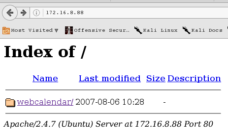

# Writeup on Darknet-1

Range: 172.16.8.60 - 90

so first thing first, ping sweep and you will find the host which is

```
    172.16.8.88
```

immediately, I did a nmap scan on it and it returns

```
22/tcp open  ssh     syn-ack ttl 63 OpenSSH 6.6.1p1 Ubuntu 2ubuntu2.6 (Ubuntu Linux; protocol 2.0)
80/tcp open  http    syn-ack ttl 63 Apache httpd 2.4.7
```

so I went to take a look at the webpage which is at port 80. And I was greeted with a directory access.



And I followed the folder and it was a login page filled with information.


so tried to poke around and gather information on the web application. 

And I discovered this page.

```
http://172.16.8.88/webcalendar/UPGRADING.html
```


 which showed me the version number of the web application which ```k5n Webcalendar 1.2.4``` whose exploit can be found on the Internet easily at ```https://www.exploit-db.com/exploits/18775/```
 
 After running the exploit, 


you will be given a restricted shell and you are ```www-data```. 


So now what you want to do is to escalate your privileges, so I went around poking.
 
 Eventually, I ran ```sudo -l``` and saw this
 
 

And so, it is clearly stated that user ```www-data``` can run ```vi``` with ```sudo```. That's the equivalent of being able to read and write as ```root```.

And also, to get root, you can use these commands within ```vi```

```
:set shell=/bin/bash
:shell
```


So I just went ahead and did a ```cat /root/proof.txt``` and I got the flag.

```
247beb9a259072431fab695ff2edd723
```

